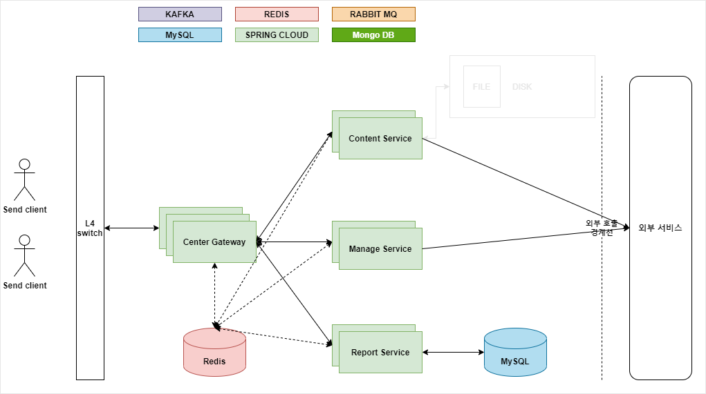

# 통합 메시지 발송 시스템 (Integration Messaging System.)

_대충적는 초안_

## 기술 스택

### Spring boot

- Java8
- Junit5
- Rest-docs
- Spring boot >= 2.4.5
- Spring cloud
- gateway
  - circuit breaker
  - fallback

### Database

- JPA, QueryDSL
- Mysql
- MongoDB > =4.x (analyzer)
  - Replica
- Flyway
- Redis (Cluster)
  - Lettuce

### Message broker

- kafka (kafka streams)
  - Cluster 구성(3 대)

### CI / CD

- jenkins
- docker & k8s(kubernetes)

### WEB
#### Admin, Console
- Vue.js

## 모듈 구성

API(GATEWAY, MESSAGE) / router / kako, mt, email, push, rcs / report(callback_uri) / store / analyzer / sba / data-flow / admin, user admin / common, protocol

| Application       |      | PORT (web)    | 설명                                                 |
| ----------------- | ---- | ------------- | ---------------------------------------------------- |
| IMS-SBA           |      | 29000         | 스프링 부트 어플리케이션 모니터링                    |
|                   |      |               |                                                      |
| IMS-GATEWAY       |      | 30001 ~ 30100 | API GATEWAY                                          |
| IMS-API-KAKAO     |      | 30101 ~ 30200 | 카카오 메시지 접수 API 모듈                          |
| IMS-API-EMAIL     |      | 30201 ~ 30300 | 이메일 메시지 접수 API 모듈                          |
| IMS-API-PUSH      |      | 30301 ~ 30400 | 앱푸시 메시지 접수 API 모듈                          |
| IMS-API-MT        |      | 30401 ~ 30500 | 문자 메시지 접수 API 모듈                            |
|                   |      |               |                                                      |
| IMS-ROUTER        |      | 40001 ~ 40100 | 접수메시지 분배 모듈 (인증, 실시간, 대량, 광고, 등), |
| IMS-CHANNEL-KAKAO |      | 40101 ~ 40200 | 카카오 메시지 발송 모듈                              |
| IMS-CHANNEL-EMAIL |      | 40201 ~ 40300 | 이메일 메시지 발송 모듈                              |
| IMS-CHANNEL-PUSH  |      | 40301 ~ 40400 | 앱푸시 메시지 발송 모듈                              |
| IMS-CHANNEL-MT    |      | 40401 ~ 40500 | 문자 메시지 발송 모듈                                |
|                   |      |               |                                                      |
| IMS-STORE         |      |               | 모든 DB 처리                                         |
| IMS-ANALYZER      |      |               | log 분석 등..                                        |
| IMS-REPORT        |      |               | 클라이언트 결과 전달(callback 방식으로 지원)         |
|                   |      |               |                                                      |
| IMS-ADMIN         |      |               | IMS 시스템 통합 관리 어드민                          |
| IMS-CONSOLE       |      |               |                                                      |
|                   |      |               |                                                      |
|                   |      |               |                                                      |
|                   |      |               |                                                      |

## 모니터링

### 어플리케이션 모니터링

1. Spring boot → Spring Boot Admin(SBA) → slack 연동.
2. KAFKA → 카프카 매니저(CMAK), 프로메테우스 + jmx exporter + grafana
3. Redis → redis stat
4. job → Spring cloud data flow ?
5. ETC ...

## 알람 (Notification)

- 내부알람
  - 슬랙(SBA 연동) 연동, 문자 메시지(sigar ??)
- API 사용자 알람
  - 발송 실패건수 일 배치 08:30분에 api 사용 유저에게 전송 예정
  - 

## 소스코드 형상관리

- Git & GitHub

## 프로젝트 아키텍처
#### (정리중) 메시지 발송 API 구성도

#### (정리중) 센터 API 구성도

### API 연동규약서
- [알림톡 연동규약 보기](./mdfiles/kakao_message.md)
- [문자 메시지 연동규약 보기](./mdfiles/mt_message.md)
- [앱푸시 메시지 연동규약 보기](./mdfiles/push_message.md)
- [이메일 메시지 연동규약 보기](./mdfiles/email_message.md)
- [관리항목 연동규약 보기](./mdfiles/center_api.md)
- [별첨 - 결과코드 표](./mdfiles/report_code.md)

## KAFKA Topic
- [카프카 토픽 리스트](./mdfiles/kafka_topic_list.md)

## 테이블 설계
- https://aquerytool.com:443/aquerymain/index/?rurl=4308e55d-5bdb-49df-9b26-4000992e60c7 / 2i3i2w

## 팀 소개

#### 기타
- 배너사용 (https://devops.datenkollektiv.de/banner.txt/ - jerusalem, 대문자만 사용)
- _이슈관리 템플릿_, 
---

